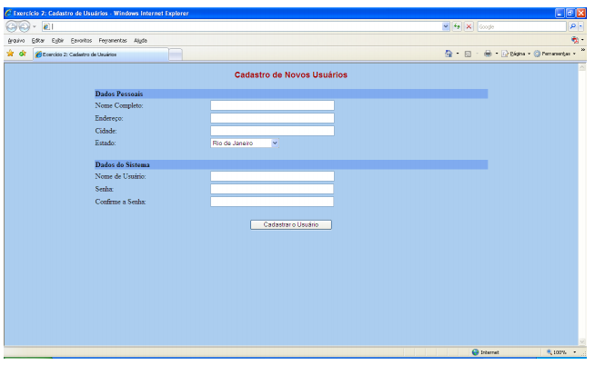

# Leia-me

## Descrição do trabalho

**Cursos:**
 - Superior de Tecnologia em Análise e Desenvolvimento de Sistemas 
 - Superior de Tecnologia em Sistemas para Internet 1

**Disciplina:**
Programação para Internet 1

**Professora:**
Sirlei Inês Sulzbach

### _Trabalho Prático 1 – HTML, CSS e JavaScript_
O trabalho poderá ser realizado em grupo, de no máximo dois integrantes, e deverá ser postado até o dia 10/09, no Blackboard.

Desenvolva a página de internet a seguir (index.html); coloque o nome dos integrantes do grupo no início do conteúdo da mesma.

#### Observações:
- [x]  Ao clicar-se no botão “Cadastrar o Usuário”, deve ser exibida uma página de internet com uma mensagem de confirmação do envio dos dados, os quais devem ser reescritos. 
- [x] Fazer a verificação para que todos os campos sejam obrigatoriamente preenchidos; 
- [x] senha e confirmar senha devem ter valores iguais.
- [x] Nome completo deve ser reescrito com letras maiúsculas. 
- [x] Devem ser apresentados 10 (dez) estados diferentes.
- [x] A distribuição dos textos e dos elementos do formulário deve ser conforme está apresentado na página.
- [x] As cores ficam a escolha do grupo. A formatação do layout deve ser através de CSS.

**Bom trabalho!**

